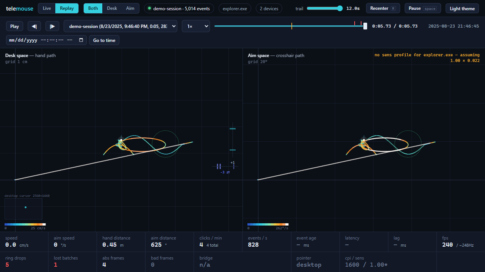

# telemouse

**See what your hand actually does when you aim.**

telemouse records every raw count your mouse reports while you play, draws
it live as your hand's path on the desk and your crosshair's path in the
game, and turns each session into a plain-language aim report: flicks,
overshoot, settle time, hand shake, click discipline.

Windows 10 or later. One zip, nothing to install, no account, nothing
leaves your PC.

## Get started

1. **Download** the zip from the
   [latest release](https://github.com/uwdivad/telemouse/releases/latest)
   and unzip it anywhere (not `Program Files`).
2. **Double-click `telemouse-ctl.exe`.** A window opens and a short guide
   asks for your mouse's CPI and your game. Every step can be skipped.
3. **Start recording → play → Stop recording.** Click **Report** next to
   the recording and read how you aimed.

No game handy? The zip ships a `demo-session` recording; hit **Report** or
**Dashboard** on it to look around first.

If Windows shows a blue *Windows protected your PC* box, choose *More info →
Run anyway*; it does that for programs it has not seen much of yet.

## What you get

- **A report you can read.** Ten aim metrics, each explained in one line,
  and a straight answer on whether any data was lost.
- **A live dashboard.** Hand path in real centimetres, crosshair path in
  degrees, click rings, and replay of any session with scrubbing.
- **An OBS overlay.** Add `http://127.0.0.1:7879/obs` as a Browser source
  and your viewers see your mouse hand live.
- **Markers.** Press **F9** in game to flag a moment ("clutch", "round
  start") and find it in the replay and the report.
- **Your data, as files.** Every session is a plain `.jsonl` file next to
  the exe. Delete the folder and telemouse is gone.
- **Light while you play.** The recorder uses well under 1% of one CPU
  core at 1 kHz.

## Fair play

telemouse only listens. It asks Windows for a copy of the raw mouse input
and reads the name of the program in front. It never hooks, never changes
or fakes input, never draws over the game, never touches the game's
process, and never asks for administrator rights. The exact list of what it
does and does not do is in [docs/FAIR-PLAY.md](docs/FAIR-PLAY.md).

## More

- **[Help](docs/HELP.md)**: settings, OBS on a second PC, hotkeys, what it
  writes and how to remove it, troubleshooting.
- **[Guide](docs/GUIDE.md)**: how it works inside, every config key and
  overlay option.
- **[API](docs/API.md)**: the HTTP routes, JSON shapes and files, for
  scripts and agents.
- **[Developing](docs/DEVELOPING.md)**: building from source, tests,
  releasing. **[Changelog](CHANGELOG.md)**.

Found a bug? [Open an issue](https://github.com/uwdivad/telemouse/issues);
[Help](docs/HELP.md#reporting-problems) says what to attach.

MIT licensed, see [LICENSE](LICENSE).
